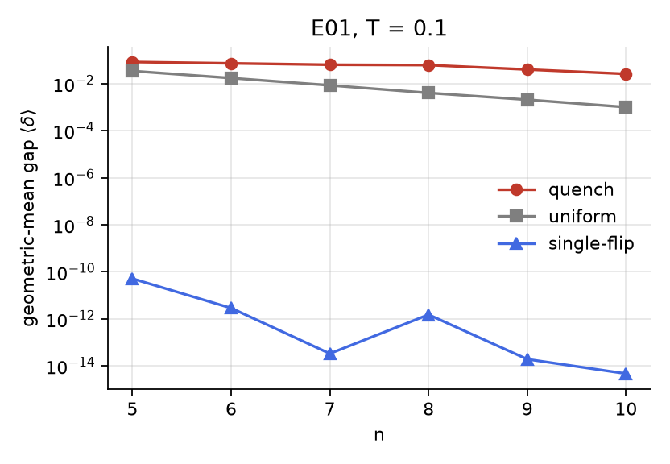
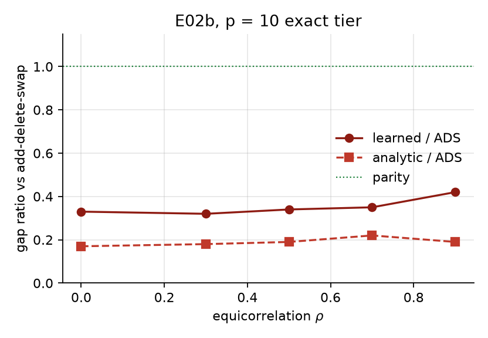
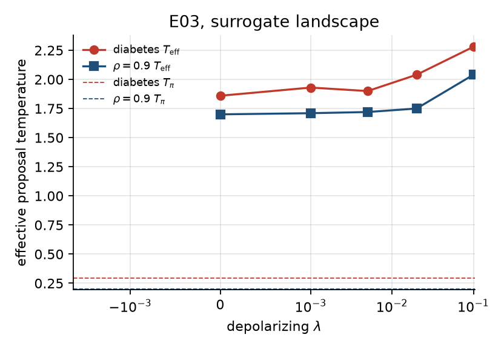
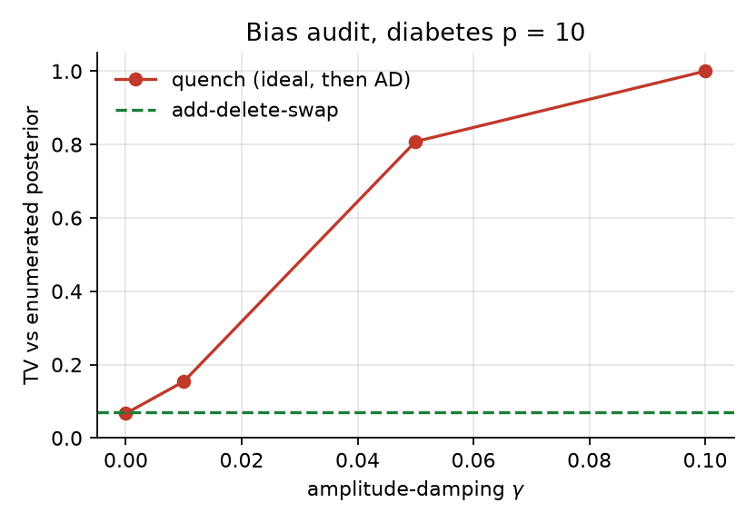

# Quantum-enhanced MCMC for spike-and-slab variable selection

TunnelVision draft · August 2026 · [github.com/fishygeek91/tunnelvision](https://github.com/fishygeek91/tunnelvision)

Numbers below are copied from the tracked experiment summaries. They are not rounded for effect. This is not a hardware paper.

## Abstract

Layden et al. showed that a short quantum quench can propose MCMC moves whose spectral gap, on low-temperature spin glasses, decays much more slowly with size than a uniform or single-flip kernel. The selling point was exactness: the quantum device only proposes; a classical Metropolis-Hastings step keeps the chain on the target, so noise can slow the sampler but cannot bias it. We asked whether that construction helps on a problem statisticians actually run, g-prior spike-and-slab variable selection, where the field-standard kernel is add-delete-swap, not uniform flip.

It does not. On the sklearn diabetes data (p = 10, 1024 models, exact transition matrix) a learned-surrogate quench has gap 0.0090 against add-delete-swap at 0.0225 (0.40×). On equicorrelated synthetics the learned/ADS ratio grows from 0.33× to 0.42× as ρ goes from 0 to 0.9 and never crosses 1. At p = 20 a live Trotter quench costs 2-3 seconds per proposal and does not mix (R̂ 1.45-1.74); add-delete-swap finishes in about a second with R̂ ≈ 1. Scheduled depolarizing noise heats the proposal (T_eff 1.86 → 2.28 on diabetes) and does not rescue the gap. A random-scan ladder of those rungs matches its coldest rung and loses to add-delete-swap. Amplitude damping at γ = 0.01, the non-unital stand-in for T1, doubles total variation versus the enumerated posterior while PIP error stays put. We did not run on IBM.

The construction is fine. The wall between surrogate and accept/reject held. The mixing advantage, on this target, is not there.

## 1. Introduction

Quantum-enhanced MCMC (Layden et al., *Nature* 619, 282, 2023) uses a quantum computer as a proposal engine. Prepare the current bitstring, evolve under a mix of the problem Hamiltonian and a transverse field for a random time, measure. The measured bitstring is the proposal. Accept or reject with the usual Hastings ratio. If the evolution is time-symmetric the proposal is symmetric and the log-q terms drop out.

That last sentence is doing a lot of work. It is why the paper could say the answer stays exact on noisy hardware: unital noise (depolarizing, dephasing) preserves the symmetry, and even if the proposal is a mess the Metropolis filter still aims at the right Boltzmann distribution. Speed is allowed to die. The posterior is not.

Almost every published follow-up kept the target as an Ising spin glass or a combinatorial energy (Max Independent Set, QAOA-shaped proposals, annealer proposals). Bayesian variable selection is a different object. The state is an inclusion vector γ ∈ {0,1}^p. The target is a g-prior marginal posterior, not a 2-local energy. The kernel a statistician would actually use is add-delete-swap, which already jumps between competing models. Beating uniform flip on that space proves nothing.

We put a Layden quench on that posterior anyway. The quench Hamiltonian cannot be the exact log-posterior (log-dets are not 2-local), so a cheap Ising surrogate (h, J) shapes the proposal, and accept/reject always evaluates the exact g-prior. That split is ordinary in classical MCMC. It is the thing that makes the quantum proposal legal.

Orfi and Sels (two *Phys. Rev. A* papers in 2024) already bounded how much help a quench can give. The gap is controlled by how localized the quench eigenstates are. Too ergodic and the proposal is uniform. Too perturbative and it is classically simulable. A quench that is “hot” relative to the target sits in the first regime. We measure that heat later; T_eff on the surrogate is already several times T_π before any noise is added. So a loss to a local classical kernel is not a shock. It is what those bounds say should happen once the target is no longer a low-temperature spin glass.

The rest of the paper is the measurement. Section 2 is the setup, including the wall that keeps the surrogate out of accept/reject. Section 3 reproduces Layden on Ising glasses (calibration). Section 4 is the variable-selection result. Sections 5 and 6 are the two noise questions: does scheduled depolarizing heat help, and does the symmetric-q slogan survive a non-unital channel. Section 7 says what is left.

Quantum MCMC has reached Bayesian venues. Holbrook’s quantum parallel MCMC and the *Bayesian Analysis* multiproposal paper are real. Neither is a Layden quench on spike-and-slab inclusion vectors. That is the niche. It is not “first quantum MCMC for Bayes.”

## 2. Setup

### 2.1 Target

The target is the g-prior spike-and-slab posterior over inclusion vectors, the George-McCulloch object with Zellner’s g-prior on the slab. For a design X ∈ ℝ^{n×p} and response y, each γ selects a column subset. The marginal likelihood after integrating the slab is a closed form involving the residual sum of squares of the selected model. We use a prior inclusion probability of 1/2 unless noted.

Two numerical details matter more than the statistics. The empty model (γ = 0) is its own closed form; you cannot feed a 0×0 Gram matrix to a Cholesky. And the determinant is `slogdet`, never `det`. X and y are centered and scaled once at construction. X'X and X'y are cached, so a state costs O(|γ|³) rather than O(np²).

At p ≤ 20 we enumerate. Diabetes is p = 10 (Efron et al., the sklearn copy): 1024 models, exact posterior, exact inclusion probabilities. The synthetic design is equicorrelated or AR(1), sparse true support, fixed SNR. Those knobs are in the experiment configs.

### 2.2 The wall

Kernels propose. They do not accept. A kernel returns (y, log q(y|x), log q(x|y)). The engine computes

    A = min(1, exp(Δlog p + log q_rev − log q_fwd)).

Symmetric kernels return 0, 0. Add-delete-swap is not symmetric at the empty or full model (delete is illegal from γ = 0, add is illegal from γ = 1) and we do not pretend otherwise.

The surrogate (h, J) is fixed data, like X and y. It may shape the proposal. It may not enter the Hastings ratio. If changing the surrogate changes posterior estimates beyond Monte Carlo error, something crossed the wall. We treat that as a bug, not a result. The exact-side modules (engine, targets, diagnostics, tempering) import nothing from Qiskit.

### 2.3 Surrogate

The quench needs a 2-local Hamiltonian. The exact log-posterior is not one. Two constructions:

- **Analytic.** Fields from |x_j'y|, antiferromagnetic couplings from the off-diagonal of X'X, a sparsity field from the prior log-odds. Cheap, and wrong when predictors are collinear: the coupling term fights the thing the quench is supposed to tunnel through.
- **Learned.** Ridge-fit (h, J) to exact log p(γ) at random γ. At p = 10 that is a fit to a 1024-point table; at p = 20 we subsample. Spearman(−E, log p) over the enumerable set is the cheap check. On diabetes the analytic surrogate scores 0.59 (ground state ranked 73rd). The learned one scores 0.98 (ranked 11th). We run both. The learned one is the honest quantum arm.

### 2.4 Kernels

- **Uniform flip.** Propose a uniform random bitstring. Symmetric. The weakest baseline, included for scale; beating it proves nothing on this space.
- **Single flip.** Flip one uniformly chosen bit. Symmetric.
- **Add-delete-swap.** With equal probability among the legal move types, add a predictor, delete one, or swap. This is the kernel. From a state of size k in p dimensions the add reverse of a delete is not the same number, and swap has k(p−k) partners. We write q(y|x) and q(x|y) per move type. Legal-type accounting at the boundary is the place a “symmetric ADS” rewrite goes wrong; the tests sit on the empty model, the full model, and |γ| = 1.
- **Quench.** Layden’s procedure. H(w) = (1−w) α H_prob + w H_mix, α the Frobenius ratio, w ~ U[0.25, 0.6], t ~ U[2, 20], fresh every proposal. (Layden writes the mixing weight as γ; we rename it w because γ is the inclusion vector here.) Exact expm for the Nature Fig. 2 path and the p = 10 gaps. Second-order symmetric Trotter (Δt = 0.8) for anything that has to be a circuit. First-order Trotter would break Q = Qᵀ and silently invalidate the Hastings ratio; we test the palindrome.

A global depolarizing mix Q_λ = (1−λ)Q + (λ/2^p) 11ᵀ is the exact-tier noise model. It is unital and exactly symmetric. Per-gate Aer depolarizing at p_err = 0.005 maps onto λ̂ ≈ 0.65; the λ ≤ 0.1 sweep is colder than a realistic circuit.

Amplitude damping is the other channel. It is not unital. Returning log-q = 0 under that channel is an approximation. Section 6 measures the residual.

### 2.5 Scoreboard

At p ≤ 10 the transition matrix is enumerable. The spectral gap δ = 1 − |λ₂| is exact. Rejection mass sits on the diagonal; forgetting that is the classic bug that makes a gap look fine while rows fail to sum to 1. We assert row sums in the builder.

ESS uses Sokal’s windowed integrated autocorrelation time, not a full-length sum. Split-R̂ (Gelman-Rubin, Vehtari split) is the stuck-chain detector: one long chain parked in a mode looks converged; four chains that disagree do not. PIP error is max-abs versus the enumerated inclusion probabilities.

ESS is reported per step and per wall-clock second. A bigger gap that costs a hundred times more per proposal is not an advantage. At the exact tier, ESS/sec is tabulated-Q sampling plus MH; it prices the kernel, not a QPU. At p = 20, ESS/sec is the live Trotter.

## 3. Calibration: Layden’s spin glasses

Before believing a loss we need to know the quench is the same object Layden ran. Fully-connected glasses, random fields, n = 5-10, T ∈ {0.1, 0.3, 1.0}, 20 instances per cell, exact expm, geometric-mean gap (arithmetic means are dominated by easy instances and flatten k).

At T = 0.1, ⟨δ⟩ ∝ 2^{−kn} gives k_quench = 0.316 and k_uniform = 1.022 (ratio 3.24). The Nature figure, arithmetic means, 500 instances, n = 3-10, is about 0.26-0.29 versus 1.0. We are in the same neighborhood. Single-flip gaps underflow on the hard instances at T ≤ 0.3; that geometric-mean k is not a physical exponent and we do not use it as one.

**Figure 1.** Geometric-mean spectral gap versus n at T = 0.1. Quench decays slowly; uniform is a factor of two per qubit; single-flip is off the bottom of the plot on the hard instances.

Fit range is n = 5-10. n = 8-10 alone overestimates quench k (~0.62). The Nature lever arm is n = 3-10. Twenty instances versus their 500 is enough for the exponent, not for error bars we would print as a claim. E01 uses exact e^{−iHt}. The Trotter circuit is what the later sections run; `tests/test_quench.py` checks that the two palindromes match, including the field-sign convention (s = 2x−1 in numpy, Z|0⟩ = +1 in Qiskit).

This is a calibration. It says the kernel, the gap code, and the geometric-mean fit are not broken. It does not say the kernel will win on a g-prior.

## 4. Variable selection

### 4.1 Diabetes, exact tier

Sklearn diabetes, p = 10, prior inclusion 1/2. Five kernels, exact gaps, ESS from chains that sample the same Q the gap used.

| kernel | gap | accept | PIP err | ESS/step | ESS/sec |
| --- | --- | --- | --- | --- | --- |
| uniform | 0.0035 | 0.008 | 0.236 | 0.007 | 115 |
| single-flip | 0.0093 | 0.124 | 0.105 | 0.015 | 261 |
| add-delete-swap | 0.0225 | 0.095 | 0.126 | 0.018 | 313 |
| quench, analytic surrogate | 0.0068 | 0.036 | 0.073 | 0.004 | 67 |
| quench, learned surrogate | 0.0090 | 0.069 | 0.072 | 0.020 | 327 |

Add-delete-swap is the baseline. Learned quench is 0.40× on the gap and 1.04× on tabulated ESS/sec. Analytic quench is 0.30× on the gap and 0.21× on ESS/sec; the worse surrogate is a worse proposal, as it should be, and the PIP errors (0.07-0.13) are Monte Carlo, not a wall breach. 1/δ is tens to hundreds of steps; a few thousand draws will not pin PIPs to 0.01.

Diabetes is mildly correlated. A loss here could still have been a “wait for the ρ-sweep” story. It was not.

### 4.2 Correlation sweep

Equicorrelated synthetics, p = 10, n = 120, k_true = 3, SNR = 2, ρ ∈ {0, 0.3, 0.5, 0.7, 0.9}. Same exact-tier scoreboard.

| ρ | ADS | analytic | learned | analytic/ADS | learned/ADS |
| --- | --- | --- | --- | --- | --- |
| 0.0 | 0.0710 | 0.0118 | 0.0231 | 0.17× | 0.33× |
| 0.3 | 0.0696 | 0.0122 | 0.0226 | 0.18× | 0.32× |
| 0.5 | 0.0695 | 0.0135 | 0.0233 | 0.19× | 0.34× |
| 0.7 | 0.0694 | 0.0153 | 0.0244 | 0.22× | 0.35× |
| 0.9 | 0.0694 | 0.0133 | 0.0294 | 0.19× | 0.42× |

**Figure 2.** Gap ratio versus add-delete-swap. The learned arm inches up with ρ because the quench improves slightly and ADS is flat. It does not cross 1. The analytic arm never gets going; Spearman(−E, log p) falls from 0.64 to 0.36 and the surrogate ground state drops to rank 444 of 1024.

Split-R̂ on the ESS chains is ≤ 1.07 for ADS and both quenches. Uniform at ρ = 0.9 is 1.12. Nobody is stuck. The quench is just slower.

### 4.3 Ablations, still exact tier

Two checks, because a negative result that dies under a different surrogate or a bit of noise is a different paper.

Depolarizing the learned Q at λ ≤ 0.1 barely moves the ratio (diabetes 0.40× → 0.38×; ρ = 0.9 0.42× → 0.39×). The interesting number is the Aer map: per-gate p = 0.005 already corresponds to λ̂ ≈ 0.65. The exact-tier noise sweep is colder than a circuit.

Corrupting the learned (h, J) at relative scale σ, re-pinning Frobenius so α stays 1, drops Spearman from 0.99 toward 0.3 and kills the gap. PIP error stays at Monte Carlo. The wall held. A bad surrogate makes a bad proposal. It does not leak into the posterior.

### 4.4 Sampled tier, p = 20 and p = 27

Above p = 14 there is no honest spectral gap. Four independent chains, split-R̂, PIP error versus enumeration at p = 20 (the last enumerable size), live Trotter wall-clock.

A p = 20 Trotter proposal is 2.0 s (ρ = 0.5) to 2.8 s (ρ = 0.9). Four chains of 160 steps take about half an hour and do not mix: R̂ = 1.45 and 1.74, PIP error 0.50 and 0.24. Add-delete-swap on the same cells is 1.5 s total, R̂ ≈ 1.00, PIP error 0.03 and 0.02. ESS/sec is 0.02 versus 380-430.

| ρ | kernel | accept | PIP err | ESS/step | ESS/sec | R̂ | wall (s) |
| --- | --- | --- | --- | --- | --- | --- | --- |
| 0.5 | add-delete-swap | 0.288 | 0.033 | 0.031 | 381 | 1.00 | 1.5 |
| 0.5 | single-flip | 0.207 | 0.031 | 0.036 | 837 | 1.01 | 0.8 |
| 0.5 | quench, learned | 0.200 | 0.500 | 0.080 | 0.02 | 1.45 | 1903 |
| 0.9 | add-delete-swap | 0.299 | 0.020 | 0.035 | 427 | 1.00 | 1.5 |
| 0.9 | single-flip | 0.215 | 0.031 | 0.033 | 777 | 1.01 | 0.8 |
| 0.9 | quench, learned | 0.197 | 0.235 | 0.092 | 0.02 | 1.74 | 1840 |

The raw ESS/step ratio (quench 2.5× ADS) is not a result. Those chains have not mixed. Even if they had, four orders of magnitude on wall-clock would still lose. That is the failure mode this comparison exists to catch.

Single-flip is competitive with add-delete-swap on ESS/step and faster per second. That is a classical finding. It does not rescue the quench.

p = 27 cannot construct the quench. The problem Hamiltonian’s diagonal is enumerated over the full basis; the code refuses n > 24. That is a construction limit, not a missing measurement. Classical kernels at p = 27 mix (R̂ ≤ 1.03) and agree on PIPs to 0.06-0.07.

The learned surrogate is not the alibi. Sampled Spearman is 0.998 at every p = 20 and p = 27 cell. Analytic collapses (0.37 down to −0.11). Surrogate quality did not enter accept/reject: ADS PIP error stays at Monte Carlo.

## 5. Noise as a proposal temperature

The folklore: depolarizing noise heats the proposal, a hotter proposal mixes, therefore scheduled noise is free tempering. The construction that makes that legal is a *fixed* ladder. Each rung is a quench at a locked λ. A random-scan mixture of symmetric kernels is symmetric. Picking the rung from the current state is a different kernel and needs log-q or diminishing adaptation (Roberts and Rosenthal, 2007). We did not do that. The nearest published neighbor treats hardware noise as an effective temperature to be estimated and corrected (Nelson et al., 2022, on annealers); here the noise is scheduled and MH stays exact, so nothing needs estimating.

T_eff is the Boltzmann temperature on the *surrogate* energy whose mean matches ⟨E(y)⟩ for y ~ Q_λ(·|x), x ~ π. It is a proposal diagnostic. It does not touch accept/reject.

**Figure 3.** T_eff versus λ. Diabetes goes 1.86 → 2.28; the ρ = 0.9 synthetic goes 1.70 → 2.04. T_π is 0.29 and 0.20. The noiseless quench is already a hot proposal. λ ≤ 0.1 is a modest further shove.

On the exact-tier scoreboard the ladder matches its coldest (best) rung (0.99× on diabetes, 0.98× at ρ = 0.9) and is 0.39× / 0.41× add-delete-swap. A mixture of already-losing kernels is an average. The Aer-realistic hot rung at λ̂ = 0.65 shrinks the gap further (diabetes 0.40× → 0.25× ADS; ρ = 0.9 0.42× → 0.18×) and cuts ESS/eval.

Classical parallel tempering is the comparison that is actually about temperature. K = 5 replicas, β ∈ [0.2, 1], ADS on each replica, swaps on the exact g-prior. PT has no 2^p gap; the scoreboard is ESS per cold-chain step and ESS per target evaluation. ESS/step jumps (diabetes 0.018 → 0.133; ρ = 0.9 0.054 → 0.147) and the diabetes PIP error drops 0.126 → 0.018, so the cold chain is mixing. Charged per evaluation that is 1.44× ADS on diabetes and 0.54× ADS at ρ = 0.9. Mean swap-accept is about 0.71, so the β ladder is conservative. PT does not make a quench kernel beat ADS on the gap.

So: noise heats. A proposal-temperature ladder does not help. Target-temperature PT does what PT does, and still does not rescue the quench.

## 6. The symmetric-q approximation

Time-symmetric evolution plus unital noise keeps Q ≈ Qᵀ. Amplitude damping does not. Real devices have T1. If a hardware kernel still returns log-q = 0, the Hastings ratio is using the wrong odds.

We did not go to IBM. We ran the same audit on Aer amplitude damping, diabetes p = 10, four chains of 8000 steps, damping strength γ ∈ {0.01, 0.05, 0.1} (the standard amplitude-damping parameter, not the inclusion vector), against the enumerated posterior. Ideal quench (no extra channel) and add-delete-swap sit on the same floor.

| kernel | TV | PIP err | R̂ | accept |
| --- | --- | --- | --- | --- |
| quench, ideal | 0.067 | 0.026 | 1.00 | 0.089 |
| quench, AD γ = 0.01 | 0.154 | 0.026 | 1.05 | 0.005 |
| quench, AD γ = 0.05 | 0.808 | 0.320 | 2.61 | 0.000 |
| quench, AD γ = 0.1 | 1.000 | 0.820 | 3.70 | 0.000 |
| add-delete-swap | 0.071 | 0.052 | 1.01 | 0.089 |

**Figure 4.** Total variation versus the enumerated posterior. The dashed line is add-delete-swap. Only γ = 0.01 is a mixed chain. The two hotter points are dead.

γ = 0.01 mixed (R̂ 1.05). TV is 0.154, 2.17× add-delete-swap. PIP error is 0.026, same as the ideal quench. PIP error did not move. The posterior did. Anyone quoting inclusion probabilities from a mildly damped hardware chain and calling them exact would have passed their own check.

γ ≥ 0.05 does not mix. Accept is zero. Those TVs are not bias estimates. They say the channel kills the proposal.

This is Aer. A live IBM number could be better or worse. It is not optional if a hardware claim is going to leave the repo. 2.17× is the number we have.

## 7. Discussion

The slogan that opened the project was: the quantum device proposes, Metropolis certifies, noise cannot corrupt the answer. After the measurements it has to be said more carefully.

Unital noise on a time-symmetric quench cannot corrupt the answer. We have the exact-tier gaps and the exactness tests for that. Non-unital noise can. Amplitude damping at γ = 0.01 already doubles TV on a chain that still mixes. Returning log-q = 0 is then a choice, not a theorem.

The mixing-advantage half of the slogan did not survive contact with add-delete-swap. A learned 2-local surrogate of a g-prior is a good fit to log p (Spearman 0.98 on diabetes, 0.998 at p = 20) and a mediocre proposal. Orfi and Sels’s localization bound is the least surprising explanation we have: T_eff is already several times T_π, so the quench is proposing from something closer to uniform-on-the-surrogate than to a low-temperature tunnel. Add-delete-swap, which is allowed to change two bits and knows about model size, does not need the tunnel.

The wall held. Wrecking the surrogate wrecked the gap and left PIP error alone. That is the one positive methodological result, and it is why the negative mixing result is interpretable. If the wall had leaked we would not know which object we had measured.

We did not run on IBM. Coarse-graining (Ferguson and Wallden, *Phys. Rev. Research* 7, 013231) is the remaining way to talk about p ~ 50 without building a 2^p energy diagonal. We have not implemented it. An adaptive mixture of quantum and classical proposals is unmotivated: the quantum arm lost, and a diminishing-adaptation scheme would learn to ignore it.

Christmann et al. already wrote the quantum-inspired version: approximate the quench classically, keep MH exact. We are not claiming that idea. Our surrogate approximates the *target’s* 2-local shadow, not the quench unitary.

A referee will ask whether diabetes is too easy, whether a better surrogate would flip the gap, and whether IBM would look different. Diabetes is easy; the ρ = 0.9 synthetic is not, and the ratio still sits at 0.42×. The learned surrogate is already Spearman 0.98-0.998; the remaining error is not “we fit a bad Ising.” IBM is a different residual. We have a method for it and a simulator number. We do not have the chip number.

What we can say, narrowly: a Layden quench driven by a 2-local surrogate can sit inside an exact Metropolis sampler for spike-and-slab variable selection. On the problems we can enumerate, it is slower than add-delete-swap. Scheduled depolarizing noise does not fix that. The exactness certificate does not automatically extend to T1.

## 8. Code and data

The package is TunnelVision, `uv`-pinned, [github.com/fishygeek91/tunnelvision](https://github.com/fishygeek91/tunnelvision). Every experiment is a `run.py` plus a YAML config. Each `results/**/summary.md` records the git hash, the config, the seed, and the package versions. Diabetes is the sklearn copy of Efron et al. Synthetics are generated by `tunnelvision.data.loaders.correlated_synthetic`. The exactness suite (`tests/test_exactness.py`) is required to stay green; a broken kernel that reports honest log-q must still sample the right posterior.

Figures in this draft were remade from those summary tables (`docs/paper/make_figures.py`). They are not a second analysis.

## References

Layden, D., Mazzola, G., Mishmash, R. V., Motta, M., Wocjan, P., Kim, J.-S., and Sheldon, S. (2023). Quantum-enhanced Markov chain Monte Carlo. *Nature* 619, 282-287. arXiv:2203.12497.

Orfi, A., and Sels, D. (2024). Bounding the speedup of the quantum-enhanced Markov-chain Monte Carlo algorithm. *Phys. Rev. A* 110, 052414. arXiv:2403.03087.

Orfi, A., and Sels, D. (2024). Barriers to efficient mixing of quantum-enhanced Markov chains. *Phys. Rev. A* 110, 052434. arXiv:2408.07881.

Ferguson, S., and Wallden, P. (2025). Quantum-enhanced Markov chain Monte Carlo for systems larger than a quantum computer. *Phys. Rev. Research* 7, 013231. arXiv:2405.04247.

Christmann, J., et al. (2025). From quantum-enhanced to quantum-inspired Monte Carlo. *Phys. Rev. A* 111, 042615. arXiv:2411.17821.

Holbrook, A. J. (2023). A quantum parallel Markov chain Monte Carlo. *J. Comput. Graph. Statist.* 32(4).

Quantum speedups for multiproposal MCMC (2025). *Bayesian Analysis*. doi:10.1214/25-BA1546. arXiv:2312.01402.

George, E. I., and McCulloch, R. E. (1993). Variable selection via Gibbs sampling. *J. Amer. Statist. Assoc.* 88, 881-889.

Zellner, A. (1986). On assessing prior distributions and Bayesian regression analysis with g-prior distributions. In *Bayesian Inference and Decision Techniques*.

Efron, B., Hastie, T., Johnstone, I., and Tibshirani, R. (2004). Least angle regression. *Ann. Statist.* 32, 407-499.

Nelson, J., Vuffray, M., Lokhov, A. Y., Albash, T., and Coffrin, C. (2022). High-quality thermal Gibbs sampling with quantum annealing hardware. *Phys. Rev. Applied* 17, 044046. arXiv:2109.01690.

Sokal, A. (1997). Monte Carlo methods in statistical mechanics: foundations and new algorithms. In *Functional Integration*.

Gelman, A., and Rubin, D. B. (1992). Inference from iterative simulation using multiple sequences. *Statist. Sci.* 7, 457-472.

Vehtari, A., Gelman, A., Simpson, D., Carpenter, B., and Bürkner, P.-C. (2021). Rank-normalization, folding, and localization: an improved R̂ for assessing convergence of MCMC. *Bayesian Analysis* 16, 667-718.

Roberts, G. O., and Rosenthal, J. S. (2007). Coupling and ergodicity of adaptive Markov chain Monte Carlo algorithms. *J. Appl. Probab.* 44, 458-475.
